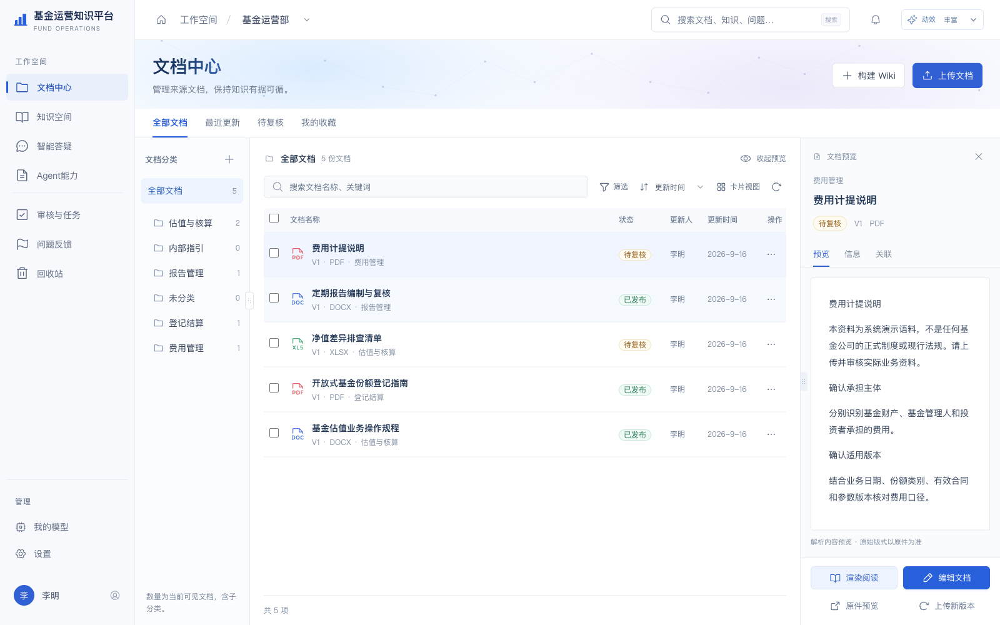
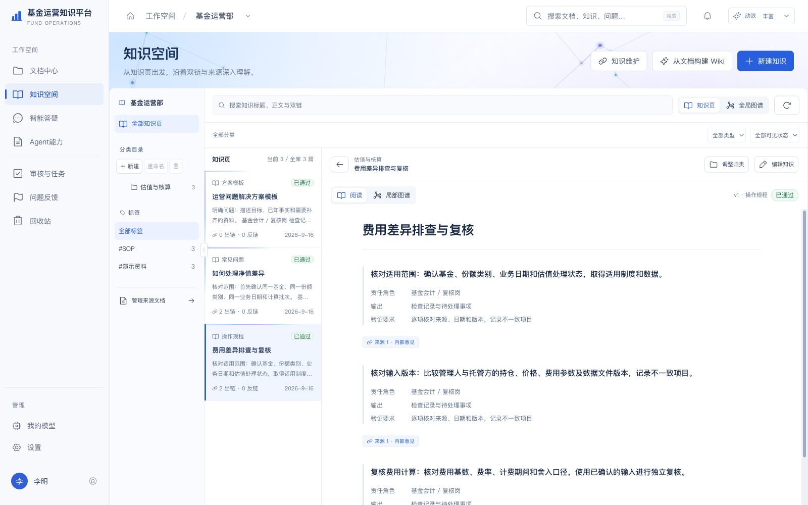
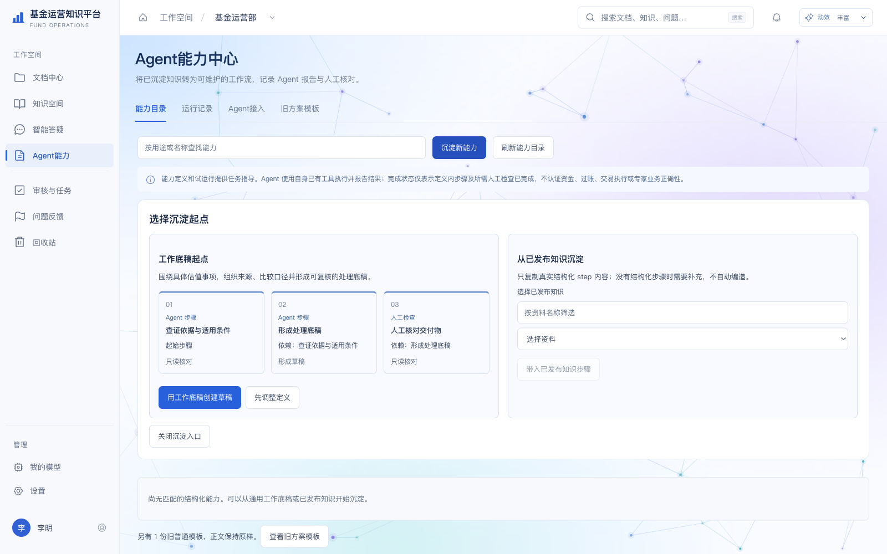
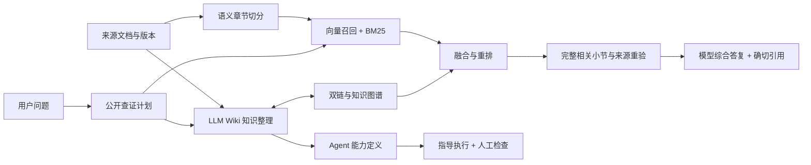

<div align="center">

# 基金运营知识平台

**让文档成为可查证的知识，让知识成为 Agent 可遵循的工作流程。**

面向中国公募基金运营场景的开源知识工作台。融合 **LLM Wiki、RAG、知识图谱与 Agent 工作流指导**，连接来源文档、专业答疑和可复用的操作能力。

[](LICENSE)
[](https://github.com/cherryym/fund-knowledge-platform/actions/workflows/ci.yml)


[快速开始](#快速开始) · [功能介绍](#功能介绍) · [部署手册](docs/deployment.md) · [配置说明](docs/configuration.md) · [架构设计](docs/architecture.md) · [使用指南](docs/user-guide.md)

</div>

> **开源范围**：本仓库包含前后端、接口契约、数据库迁移、测试、部署模板和 MCP 侧车。不包含真实基金资料、生产数据库、历史咨询、账户、API 密钥、OAuth 授权文件、向量数据或模型权重。首次启动使用明确标注的合成演示资料。
>
> **使用边界**：这是一套可部署、可继续开发的应用，不是基金估值或金融业务正确性的认证产品。模型答案、来源适用性和 Agent 产物仍需专业复核；系统不自动交易、付款、过账或确认净值。

## 为什么做这套系统

基金运营知识往往分散在法规、估值指引、交易规则、内部制度、操作手册和同事经验中。普通文件夹能保存文档，但很难同时回答：

- 这件事应该怎么处理，分几个阶段，需要哪些材料和凭证？
- 结论来自哪份原文、哪个版本、哪一段？旧规则是否已被替代？
- 文档更新后，关联知识、检索索引和引用是否仍然有效？
- 能否把已经沉淀的处理经验变成 Agent 可以读取、执行并回报的步骤？

本项目将这些问题放在同一条工作链中：**来源管理 → 知识整理 → 多路发现 → 原文核对 → 综合答复 → 工作流指导 → 人工检查**。不要求先部署本地生成模型，也不把向量分数当成业务结论。

## 页面预览

以下截图来自隔离部署的合成演示实例，不含真实业务资料；仅展示界面能力，不代表专业答疑通过验收。

### 文档中心



### 知识空间



### Agent 能力中心



## 功能介绍

| 模块 | 提供的能力 |
|---|---|
| 文档中心 | 上传原件、分类/子分类、搜索筛选、版本替换、在线渲染阅读、连续富文本编辑、修订、审核与回收恢复 |
| 知识空间 | Wiki 知识页、术语、场景、SOP、标签与目录、`[[双链]]`、反链、来源钻取、全量授权知识浏览 |
| 知识图谱 | 全局/局部关系、可拖拽节点、缩放平移、自由配色、可调高度；WebGL 批量绘制与独立 Worker 布局，保留兼容路径 |
| 智能答疑 | 模型先提出公开查证计划，联合 Wiki、原文、图谱和混合检索综合作答；Markdown 正文、逐段引用、执行记录和取消 |
| Wiki + RAG | 语义章节/条款切分，保留原块和字符跨度；向量 + BM25 候选融合、重排、相关完整小节及关联来源补读 |
| 检索方案切换 | Qwen3-Embedding-4B 与 BGE-M3 独立指纹/集合，允许保留两套结果并在网页选择，不混用不同嵌入空间 |
| 我的模型 | 每用户连接；厂商 API、OpenRouter 等网关、本地兼容服务；品牌图标、模型同步、外发授权、加密密钥或环境变量引用 |
| Codex 接入 | 独立应用身份目录、官方登录与文本推理适配；需自行完成对应版本的隔离与权限核验，不共享宿主凭据 |
| 个人/团队知识库 | 个人知识库隔离、团队阅读与成员协作编辑、服务端角色权限、独立复核和版本并发控制 |
| 规则效力 | 新旧来源替代事实、确切版本与证据绑定、有效日期与预填确认；不将未知效力自动提升为现行有效 |
| Agent 能力中心 | 输入要素、依赖步骤、输出要求、核对项、风险及人工检查；试运行、指导运行、结果回报、技能包导出 |
| MCP 侧车 | 7 个受限工具：发现能力、读取定义、启动指导流程、取下一步、读取绑定来源、回报步骤和查询运行 |
| 治理与运维 | 任务队列、失败诊断、幂等、保留策略/法律保全/依赖检查、审计；支持 OIDC、外部扫描器、对象存储和 Celery 配置 |

### 三个区域，职责清晰

- **文档中心**管理事实依据：原件、解析正文、版本、分类与审核。在线编辑生成线上修订，不覆盖原始附件。
- **知识空间**组织知识：将来源整理成可复用的知识页、关系和查证入口，始终能回到确切原文。
- **Agent 能力中心**组织行动指导：将知识转成有输入、步骤、依赖、交付物和检查人的工作流；不是给 Agent 无限制操作外部系统的权限。

## LLM Wiki、RAG 和图谱如何协作



Wiki 提供结构与语义入口，向量和 BM25 发现分散表达，图谱连接已有来源与依赖；最终仍读取当前授权原文。关系和相似度只帮助导航，不证明来源现行有效或结论成立。详见[架构设计](docs/architecture.md)与[检索配置](docs/retrieval.md)。

## 快速开始

### 方式一：源码本地运行

准备 **Python 3.12、Node.js 22、npm、uv**，然后执行：

```bash
git clone https://github.com/cherryym/fund-knowledge-platform.git
cd fund-knowledge-platform
bash scripts/start-local.sh
```

打开 **http://127.0.0.1:5178**。首次启动会安装锁定依赖并初始化独立演示数据，**不会下载大模型、连接你的真实数据库或自动调用付费模型**。

- 演示身份：李明（编辑/管理）、张慧（复核）、王磊（阅读）。这些是合成测试身份，不是生产账户。
- 后端健康检查：`http://127.0.0.1:8765/api/v1/health`。
- 未配置模型时，可浏览和管理资料；不能冒称已提供真实生成式问答。到“我的模型”配置自己的连接并确认资料传输，再主动发起咨询。
- Ctrl+C 停止开发进程，`data/` 中的本地数据保留；不要将该目录提交到 GitHub。
- 如端口已占用：`FKB_DEV_API_PORT=8766 FKB_DEV_WEB_PORT=5179 bash scripts/start-local.sh`。

### 方式二：Docker Compose 本地演示

```bash
git clone https://github.com/cherryym/fund-knowledge-platform.git
cd fund-knowledge-platform
docker compose up --build -d
docker compose ps
```

同样访问 http://127.0.0.1:5178 。Compose 默认只监听本机地址，数据库和对象文件保存到命名卷。`docker compose down` 停止服务，**不要使用 `down -v`，除非确实要删除演示卷及其中数据**。

Compose 是演示配置，不应修改端口绑定后直接当生产环境使用。Oracle/OceanBase、OIDC、HTTPS、真实扫描器、备份和监控等见[生产部署清单](docs/deployment.md#生产部署清单)。容器实际构建结果以CI为准，不能以本地源码启动替代容器验证。

## 配置与资源要求

| 用途 | 环境及资源说明 |
|---|---|
| 开发与界面体验 | Python 3.12、Node.js 22、uv；建议至少4核/8GB可用内存与数GB依赖/数据空间。这是起步建议，不是负载测试结论 |
| 云端模型答疑 / Wiki | 自行配置可用的模型账号/API；所选模型的访问权、计费与区域以服务商为准；不需要本地生成模型 |
| 本地语义召回 | 额外安装`local-models`依赖并准备嵌入/重排权重；实际内存、时间取决于模型、精度、批次和文档规模 |
| 关系数据库 | SQLite仅开发/测试；Oracle、OceanBase MySQL兼容模式提供配置与方言适配，须在目标实例独立验收 |
| 向量存储 | Qdrant服务；可选本地开发存储；不同模型使用独立指纹与集合，不能直接迁移向量数值 |
| 生产 | HTTPS反向代理、OIDC、持久化文件或S3、真实恶意文件扫描、数据库迁移与备份、受控密钥；按机构负载压测后定容 |

应用仅读取显式`FKB_`配置，**不隐式读取`.env`或其他应用密钥**。可从[`.env.example`](.env.example)和[配置手册](docs/configuration.md)开始。模型密钥不应填入源码、README、GitHub Issue、截图或提交历史。

## 技术架构

- **前端**：React、TypeScript、Vite、TipTap；GSAP动效与`prefers-reduced-motion`；WebGL/Canvas/Worker图谱。
- **后端**：FastAPI、Pydantic、SQLAlchemy、Alembic；持久化任务状态与可选Celery执行。
- **知识与检索**：LLM Wiki、语义切分、Qdrant、BM25、融合重排、双链/有类型关系、精确版本与内容块引用。
- **模型适配**：OpenAI兼容Chat Completions、Responses、Anthropic、Gemini、Ollama及受控Codex桥接，实际能力按协议/连接检查。
- **Agent 接口**：独立Python MCP stdio侧车 + 受限HTTP API，按用户、知识库、scope、有效期和当前权限校验。

```text
backend/                 API、业务服务、模型适配、检索、迁移和后端测试
frontend/                工作台、图谱、编辑器和前端测试
contracts/               基础API/答案契约与历史字段参考
integrations/fundkb_mcp/  Agent能力MCP侧车与协议测试
deploy/                  容器、反向代理及生产配置模板
scripts/                 启动、模型准备、索引与受控桥接辅助工具
docs/                    中文架构、部署、配置、使用、安全和验证说明
.github/                 CI及Issue/PR模板
```

## 文档导航

| 文档 | 内容 |
|---|---|
| [部署手册](docs/deployment.md) | 源码、容器、Oracle/OceanBase与生产准入 |
| [配置手册](docs/configuration.md) | 环境变量、身份、存储、队列、模型与密钥 |
| [使用指南](docs/user-guide.md) | 从上传文档到Wiki、答疑、图谱和Agent能力 |
| [架构设计](docs/architecture.md) | 数据边界、版本、引用、查询与任务生命周期 |
| [检索配置](docs/retrieval.md) | Wiki-only、Qwen/BGE/BM25、指纹、索引重建与切换 |
| [模型接入](docs/model-providers.md) | API/网关/本地/Codex接入及安全边界 |
| [Agent接入](docs/agent-connector-v1.md) | 七工具、凭据scope、幂等、人工检查 |
| [测试与验收](docs/testing.md) | 本地、CI、测试分类及未覆盖范围 |
| [已知限制](docs/limitations.md) | 性能、引用质量、金融准确性与生产缺口 |
| [安全政策](SECURITY.md) | 报告漏洞、保护敏感资料 |
| [贡献指南](CONTRIBUTING.md) | 开发、测试、PR与资料要求 |

## 当前成熟度与已知限制

本项目已实现主要工作流并包含自动化回归，但仍有明确边界：

1. **不承诺每题20秒或100%准确。** 模型响应、检索、重排、材料规模都影响耗时；流式预览不等于完整答案。
2. **引用可定位不等于语义正确。** 未登记引用、条件遗漏和不适用来源必须继续复核，告警不能作为“已核验”标签。
3. **没有附赠业务知识库。** 用户必须有权上传并向所选模型发送资料；未知效力、草稿及正式依据不会自动混同。
4. **Codex OAuth不是通用API余额。** 需独立身份、官方可执行文件及针对版本的文本隔离验证，不保证任意第三方账户或未来版本自动可用。
5. **Agent负责受限指导。** 没有通用shell或财务系统执行器，人工步骤不能由Agent自我批准。
6. **生产需要独立验收。** Oracle/OceanBase实际实例、机构OIDC、扫描器、容灾、多用户负载和金融专业准确性不能用演示成功代替。

详细边界见[已知限制](docs/limitations.md)。欢迎围绕通用能力改进提交Issue和PR，请勿提交真实基金、客户、员工或账户资料。

## 开源许可

本项目原创代码和文档采用 **[MIT](LICENSE)**。第三方依赖、GSAP许可、厂商图标和模型权重各自保留上游条款，详见[第三方声明](THIRD_PARTY_NOTICES.md)。
